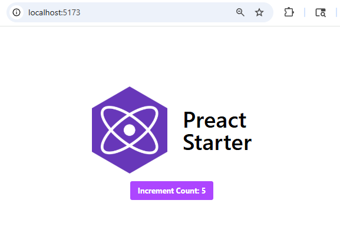

# `preact-project-starter-template`

<h2 align="center">
  
</h2>

<h3 align="center">A modern Preact starter template with TypeScript and Tailwind CSS</h3>

## Benefits of using Preact?

Preact is a fast, lightweight alternative to React, offering a similar API with a much smaller footprint. Benefits of using Preact include:

- **Tiny bundle size**: Great for performance-critical applications.
- **Familiar API**: Easily migrate from React or share knowledge between projects.
- **Seamless integration**: Works well with modern tooling and libraries.
- **Fast rendering**: Optimized for speed and efficiency.

## Features

- ⚡️ **Preact** for blazing-fast UI development
- 🟦 **TypeScript** for type safety and better DX
- 🎨 **Tailwind CSS** for rapid, utility-first styling
- 🛠️ Ready-to-use development and production scripts

## Getting Started

1. **Install dependencies:**
   ```bash
   npm install
   ```

2. **Start the development server:**
   ```bash
   npm run dev
   ```
   The app will be available at [http://localhost:5173/](http://localhost:5173/).

   <div align="center">
     
   </div>

3. **Build for production:**
   ```bash
   npm run build
   ```
   Output will be in the `dist/` directory.

4. **Preview the production build locally:**
   ```bash
   npm run preview
   ```
   Preview at [http://localhost:4173/](http://localhost:4173/).

## Project Structure

```
.
├── public/
├── src/
│   ├── components/
│   ├── app.tsx
│   └── index.tsx
├── tailwind.config.js
├── tsconfig.json
└── ...
```

## Customization

- Edit `tailwind.config.js` to customize your Tailwind setup.
- Add or modify components in `src/components/`.

## License

MIT

---

Start building fast, modern web apps with Preact, TypeScript, and Tailwind CSS!
